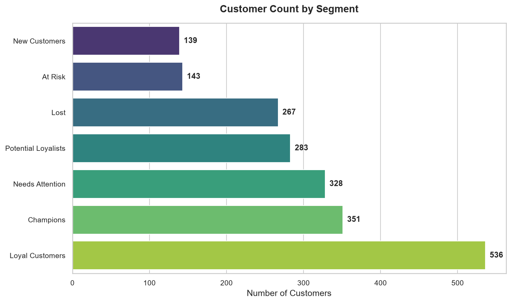
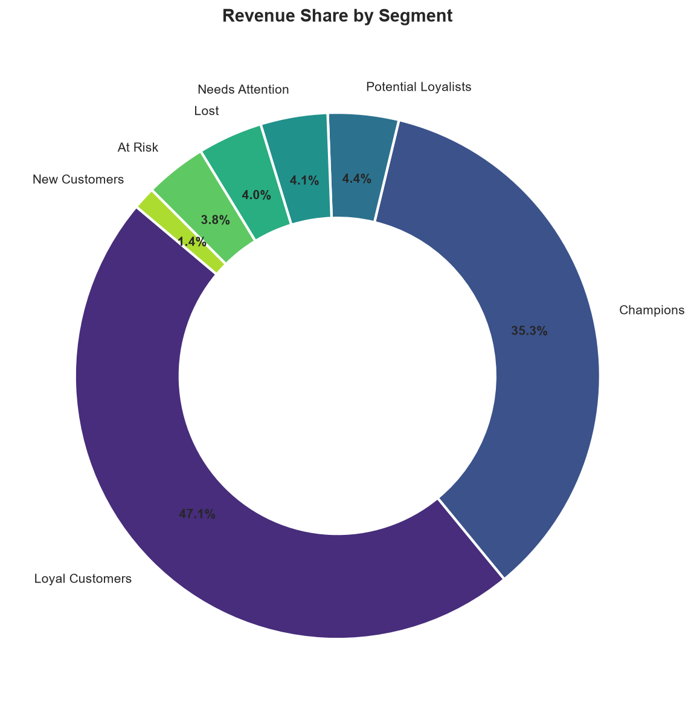
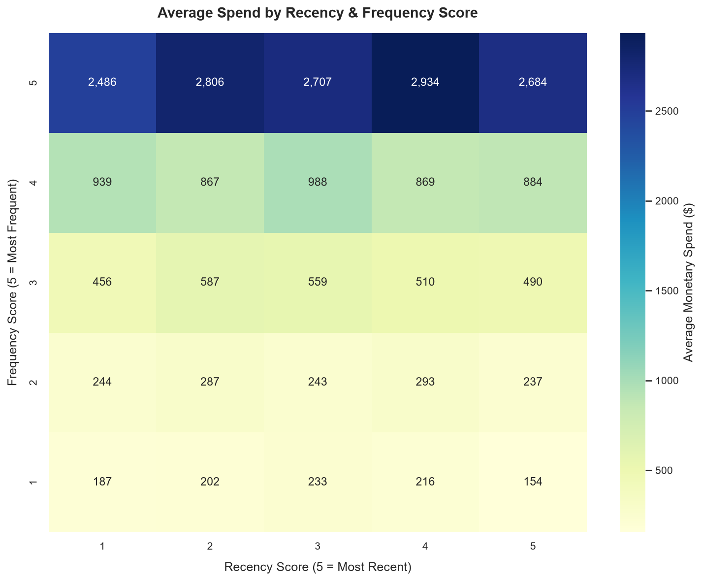
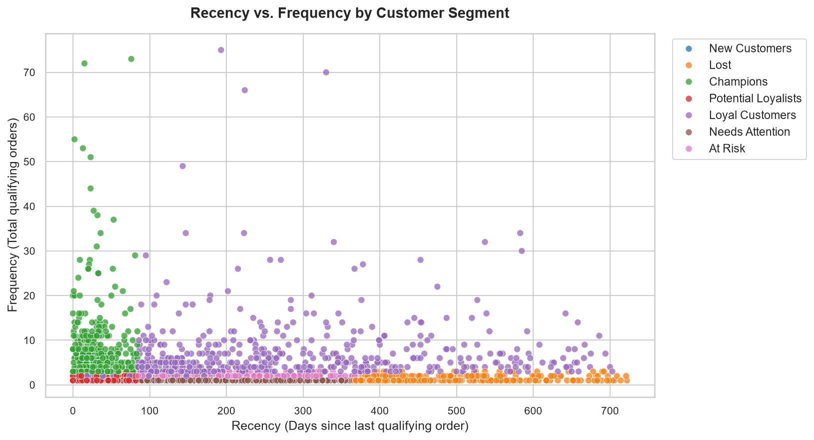
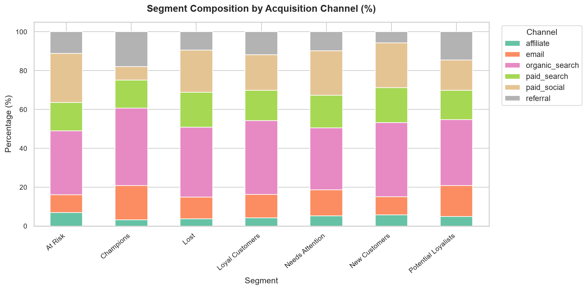
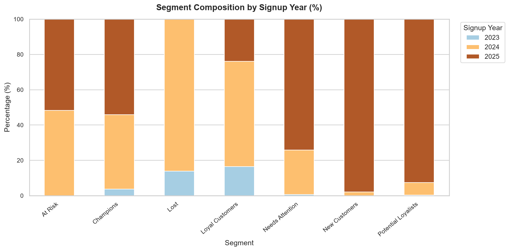

# 🛋️ Wayfair Customer Analytics: RFM Segmentation & CRM Optimization

> **Enterprise Customer Analytics & Retention Strategy**  
> Segment customers by purchasing behavior using Recency, Frequency, and Monetary (RFM) modeling to power high-converting, personalized CRM marketing campaigns.


-blueviolet)


---

## 📌 Business Scenario & Objective

Wayfair's CRM team previously sent the same generic promotional emails to all customers, causing subscriber fatigue and declining engagement. As the **Customer Analytics Lead**, I conducted an end-to-end customer segmentation using **Recency, Frequency, and Monetary (RFM)** modeling as of **January 1, 2026** to replace the blast approach with hyper-targeted, lifecycle-driven CRM campaigns.

### Key Business Questions Addressed:
1. **Customer Value Distribution:** Which customer tiers drive the vast majority of store revenue?
2. **At-Risk vs. Churned Accounts:** How many customers are slipping away, and what is the window of opportunity to intervene?
3. **Acquisition Attribution:** Do specific acquisition channels (e.g., Organic, Paid Social, Referrals) yield higher long-term customer lifetime value?
4. **Actionable CRM Strategy:** What specific incentive, messaging cadence, and primary KPI should guide each segment?

---

## 🏛️ Hybrid Architecture Overview

This repository adopts the **Hybrid Production & Analytics Architecture** required by modern data science teams:
- **Production Source Code (`src/`):** Reusable, decoupled, fully-tested Python modules for data loading, price imputation, scoring engines, statistical tests, and visualization.
- **Interactive Storytelling (`notebooks/`):** A publication-grade Jupyter Notebook demonstrating end-to-end exploratory analysis, business interpretations, and executive commentary.
- **Pipeline Runner (`main.py`):** Single-command CLI orchestrator for automated batch runs.

```
RFM Customer Segmentation/
├── Datasets/                               # Raw relational transaction data
│   ├── orders.csv                          # 9,245 order header records
│   ├── order_items.csv                     # 15,608 line-item records
│   ├── products.csv                        # 90 catalog items across 8 categories
│   └── customers.csv                       # 3,600 registered accounts
├── notebooks/                              # Interactive portfolio presentation
│   └── rfm_customer_segmentation.ipynb     # Executed notebook with full visual narrative
├── src/                                    # Modular production codebase
│   ├── __init__.py                         # Package marker
│   ├── config.py                           # Paths, constants, cutoff date (2026-01-01)
│   ├── data_loader.py                      # Data ingestion, deduplication, price imputation
│   ├── rfm_engine.py                       # Qualifying order logic, quintile scoring, segmenting
│   ├── analysis.py                         # Segment KPIs, Chi-Square test, cohort dynamics
│   └── visualization.py                    # Publication-grade plotting module
├── outputs/                                # Deliverables and visual assets
│   ├── customer_segments.csv               # 2,047 scored customers with segments
│   ├── segment_summary.csv                 # Segment KPI summary table
│   ├── segment_distribution.png            # Customer volume per segment
│   ├── revenue_share.png                   # Segment revenue contribution donut
│   ├── rfm_heatmap.png                     # Monetary spend by R & F scores
│   ├── recency_frequency_scatter.png       # Behavioral scatter plot
│   ├── segment_by_channel.png              # Acquisition channel attribution mix
│   └── segment_by_signup_year.png          # Cohort vintage distribution
├── main.py                                 # Production CLI pipeline entrypoint
├── rfm_analysis.py                         # Pipeline entrypoint wrapper
├── requirements.txt                        # Project dependencies
├── .gitignore                              # Standard Python gitignore
└── README.md                               # Project documentation
```

---

## ⚙️ Methodology & Engineering Rigor

### 1. Data Cleaning & Catalog Imputation
- **Order Deduplication:** Identified and eliminated **38 duplicate `order_id`** records.
- **Price Imputation with Catalog Fallback:** Rather than arbitrary mean imputation, **199 missing `unit_price`** instances were matched against `products.csv` using product ID lookups.
- **String & Type Hygiene:** Standardized inconsistent category casing (`Kitchen`, `kitchen`, `KITCHEN` $\rightarrow$ `Kitchen`) and parsed all datetime fields.

### 2. Economic Justification for Qualifying Orders
- ❌ **Canceled (344 orders):** Aborted prior to fulfillment; generated zero realized cash flow.
- ❌ **Returned (407 orders):** Returned and refunded; counting them would distort true customer value.
- ✅ **Completed (8,456 orders):** Fulfilled transactions representing verified consumer demand.

$$\text{Line Net Spend} = (\text{Quantity} \times \text{Unit Price}) - \text{Discount Amount}$$
$$\text{Order Total} = \sum \text{Line Net Spend} + \text{Shipping Fee}$$

### 3. RFM Scoring with Deterministic Tie-Breaking
Standard quantile binning (`pd.qcut`) breaks down when many customers share identical purchase frequencies (e.g., 1 or 2 purchases). We resolved this by applying rank-based ordering prior to binning:

```python
# Frequency Quintile Scoring with Tie Handling
rfm['f_score'] = pd.qcut(rfm['frequency'].rank(method='first'), 5, labels=[1, 2, 3, 4, 5])
```
- **Recency ($R$):** Lower days $\rightarrow$ Higher score ($5$ = most recent).
- **Frequency ($F$):** Higher orders $\rightarrow$ Higher score ($5$ = most frequent).
- **Monetary ($M$):** Higher spend $\rightarrow$ Higher score ($5$ = highest spend).

---

## 📊 Customer Segments & Commercial Results

Customers were classified into 7 distinct behavioral cohorts:

| Segment | Customer Count | % Total Customers | Total Revenue | % Revenue Share | Avg Order Value | Avg Recency | Avg Frequency | Median Cycle |
| :--- | :---: | :---: | :---: | :---: | :---: | :---: | :---: | :---: |
| **Loyal Customers** | 536 | 26.2% | $891,518.39 | **47.1%** | $237.93 | 266 days | 7.0 orders | 40.5 days |
| **Champions** | 351 | 17.1% | $668,588.75 | **35.3%** | $219.57 | 31 days | 8.7 orders | 41.0 days |
| **Potential Loyalists** | 283 | 13.8% | $82,556.28 | **4.4%** | $177.92 | 36 days | 1.6 orders | 46.5 days |
| **Needs Attention** | 328 | 16.0% | $78,259.74 | **4.1%** | $215.59 | 206 days | 1.1 orders | 66.0 days |
| **Lost** | 267 | 13.0% | $75,608.22 | **4.0%** | $200.02 | 495 days | 1.4 orders | 37.0 days |
| **At Risk** | 143 | 7.0% | $71,755.08 | **3.8%** | $224.23 | 220 days | 2.2 orders | 63.0 days |
| **New Customers** | 139 | 6.8% | $26,124.12 | **1.4%** | $187.94 | 35 days | 1.0 order | N/A |

### 💡 Core Analytical Takeaways
1. **The 80/20 Pareto Concentration:**  
   **Champions + Loyal Customers = 43.3% of customers driving 82.4% of all revenue ($1.56M of $1.89M).** Retaining this core group is paramount.
2. **Nurturing the Future Core:**  
   **Potential Loyalists** (283 buyers) have ordered recently (avg. 36 days) and exhibit strong initial basket sizes ($178 AOV). Converting them to a 3rd purchase represents the highest ROI opportunity.
3. **Churn vs. Sunsetting:**  
   **Lost Customers** have not transacted in an average of **495 days (~1.4 years)**. Rather than polluting inbox reputation with continuous blasts, these accounts should be tested with one final re-activation discount and then suppressed.

---

## 📈 Visualizations

| Customer Distribution | Revenue Contribution |
| :---: | :---: |
|  |  |

| RFM Monetary Heatmap | Recency vs. Frequency |
| :---: | :---: |
|  |  |

| Acquisition Channel Attribution | Cohort Vintage Migration |
| :---: | :---: |
|  |  |

---

## 🔬 Statistical Testing & Attribution Insights

- **Chi-Square Test of Independence:** Examined whether initial customer acquisition channel impacts ultimate segment placement.
  - $\chi^2 \text{ test } p\text{-value} = 2.22 \times 10^{-6}$ (**Statistically Significant at $\alpha = 0.01$**)
- **Channel Findings:**
  - **Organic Search & Email** drive the highest conversion to **Champions** (over 57% of Champions originated here).
  - **Paid Social** exhibits higher drop-off rates, disproportionately populating **Needs Attention** and **Lost** cohorts.
- **Cohort Vintage Findings:**
  - **2023 Cohort:** 62% converted into **Loyal Customers**, demonstrating high long-term retention.
  - **2025 Cohort:** Primarily **New Customers** and **Potential Loyalists**; none appear in **Lost**, affirming data integrity.

---

## 🎯 CRM Action Plan & Measurement Scorecard

| Segment | Strategic Priority | Recommended CRM Action | Primary Success Metric |
| :--- | :--- | :--- | :--- |
| **Champions** | High Retention | VIP perks, exclusive preview access to new product lines, priority customer support | Repeat purchase rate & 90-day AOV |
| **Loyal Customers** | Value Maximization | Multi-tier loyalty rewards, personalized category cross-sell recommendations | Customer Lifetime Value (CLV) & category expansion |
| **Potential Loyalists** | Growth / Nurturing | Post-purchase cross-sell emails, time-sensitive incentive for 3rd purchase | Conversion rate to 3rd order within 60 days |
| **New Customers** | Activation | 5-part onboarding welcome drip series, brand ethos intro, first-order follow-up | Second purchase rate within 30 days |
| **At Risk** | Win-Back | Personalized "We miss you" campaign with progressive discounts (10% $\rightarrow$ 20%) | Reactivation rate (purchase within 45 days) |
| **Needs Attention** | Re-engagement | Educational content, price drop alerts on recently viewed items, survey inquiry | Email CTR & 30-day website revisit rate |
| **Lost** | Sunset / Cleanse | Aggressive liquidation promotion; suppress unengaged accounts after 30 days | Deliverability protection & bounce rate $< 1\%$ |

---

## 🚀 Quick Start & Execution

### Option A: Run via Command Line Pipeline (Production)
```bash
# Clone repository
git clone https://github.com/Puskar-2212/wayfair-customer-segmentation-rfm.git
cd "wayfair-customer-segmentation-rfm"

# Install dependencies
pip install -r requirements.txt

# Run modular pipeline
python main.py
```

### Option B: Run via Interactive Jupyter Notebook (Presentation)
```bash
jupyter notebook notebooks/rfm_customer_segmentation.ipynb
```

All output deliverables are automatically refreshed in `outputs/`:
- `customer_segments.csv` (2,047 customer records)
- `segment_summary.csv` (KPI aggregation)
- 6 publication-ready PNG visualization assets

---

## 💼 Resume & Interview Bullet Points

```markdown
- Spearheaded customer segmentation for e-commerce store (Wayfair case) utilizing RFM modeling as of Jan 1, 2026 cutoff across 9.2k orders and 2.0k active customers.
- Engineered a hybrid modular architecture with decoupled Python production modules (src/) and an executive presentation Jupyter Notebook (notebooks/).
- Addressed zero-variance frequency ties using rank-based quintile scoring, mapping customers into 7 actionable segments.
- Uncovered that 43.3% of customers (Champions & Loyalists) drove 82.4% ($1.56M) of total revenue, authoring personalized CRM playbooks and KPI scorecards to maximize retention and CLV.
- Conducted Chi-Square statistical tests (p < 0.001) demonstrating significant differences in customer lifetime value across acquisition channels.
```

---

## 📄 License
This project is open-source under the [MIT License](LICENSE).
